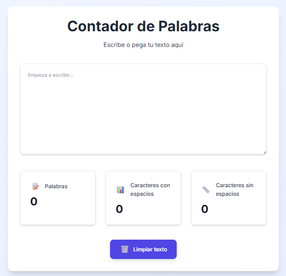

# 📝 Contador de Palabras



Una aplicación web interactiva creada con **React** y **Tailwind CSS** que permite contar palabras y caracteres (con y sin espacios), además de limpiar texto con un solo clic. Su diseño es **moderno**, **responsivo** y **agradable a la vista**, ideal para cualquier dispositivo.  

---

## ✨ Funcionalidades

- 🔤 **Conteo en tiempo real**: Muestra la cantidad de palabras y caracteres mientras escribes.
- 🧼 **Limpieza rápida**: Borra el texto completamente con un solo botón.
- 🎨 **Interfaz amigable**: Diseño limpio, minimalista y animaciones suaves.
- ♻️ **Código modular**: Componentes reutilizables para facilitar mantenimiento y escalabilidad.

---


## 🛠️ Tecnologías Utilizadas

| Herramienta     | Descripción                                                  |
|-----------------|---------------------------------------------------------------|
| ⚛️ React         | Librería JavaScript para construir interfaces de usuario     |
| 🎨 Tailwind CSS  | Framework de estilos con clases utilitarias modernas         |
| 🗂️ Git           | Sistema de control de versiones                              |

---

## 🚀 Instalación y Ejecución

Sigue estos pasos para clonar y ejecutar el proyecto localmente:

1. Clona el repositorio:

```bash
git clone https://github.com/alejandracode/Word-Counter.git
```

`2.` Accede al directorio:

```bash
cd Word-Counter
```

`3.` Instala las dependencias:

```bash
npm install
```

`4.` Inicia la app:

```bash
npm start
```

`5.` Visita http://localhost:3000 en tu navegador.

## 👩‍💻 Autora

Alejandra Girón

📧 alejandragironmira@gmail.com

💻 GitHub: alejandracode
